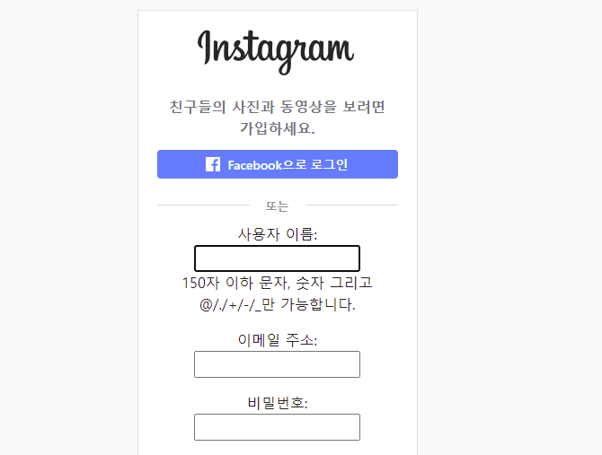
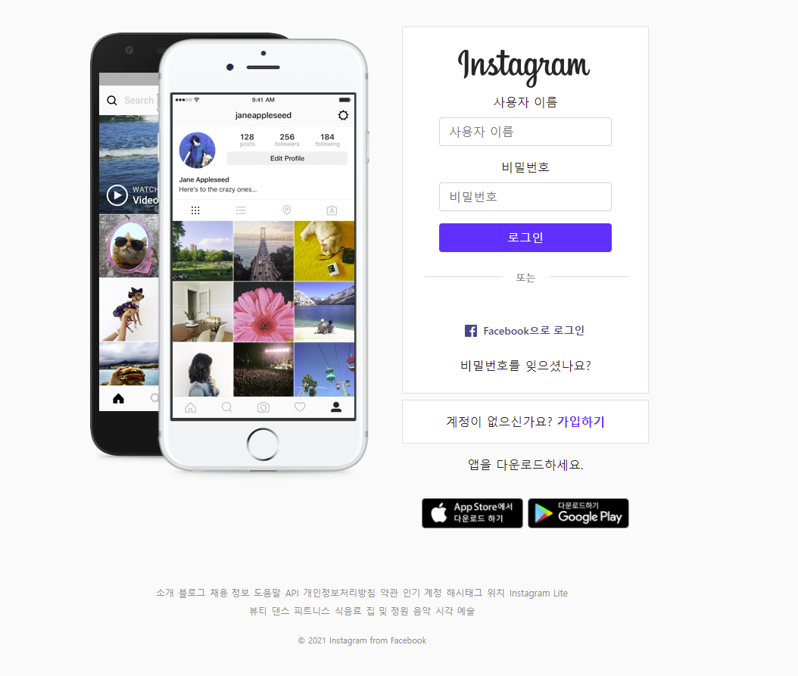
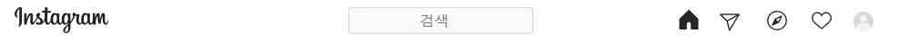
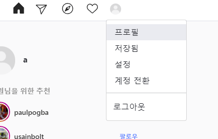
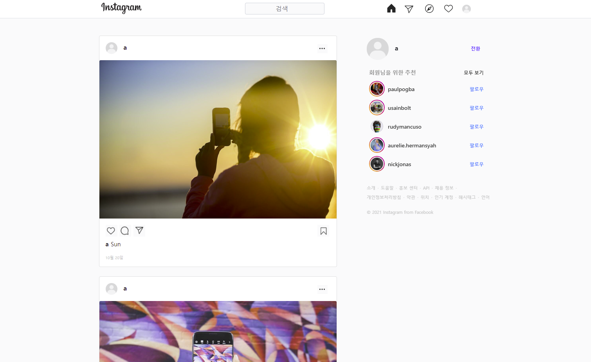
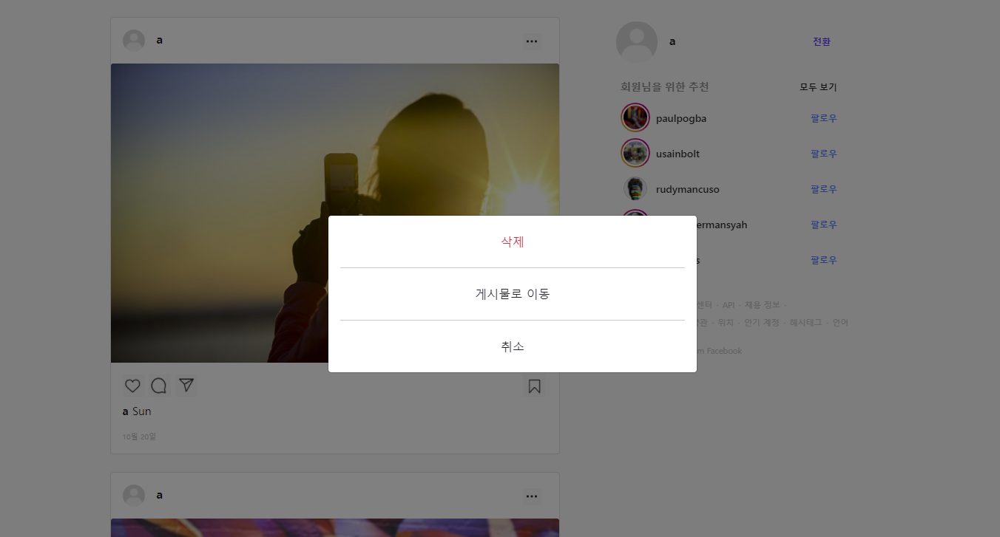
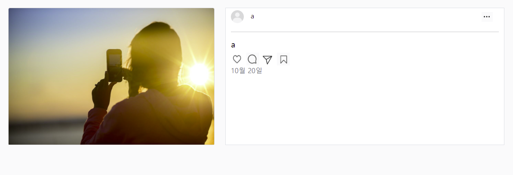
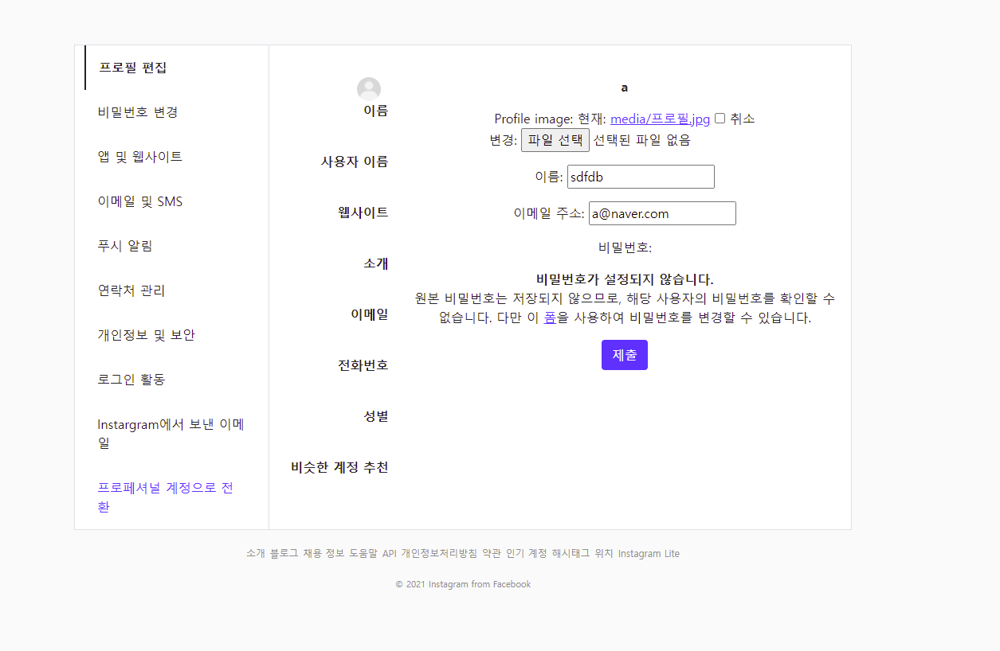
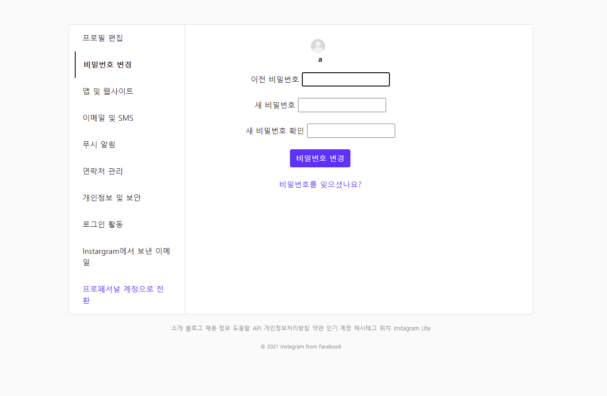

# 인스타 클론 코딩 프로젝트

### 목표

* 실제 인스타그램과 유사한 디자인
* 회원가입 및 로그인 기능
* 피드 목록 및 상세 페이지 구현
* 프로필 이미지 변경
* 비밀번호 및 회원정보 변경


## 1. 회원가입




* 인스타그램과 유사하게 페이지를 디자인 하였다.
* user model에 대한 이해가 부족하여 기존의 form을 그대로 사용하였다.
* 이로 인해 작성 form에 디테일이 부족했다.
* 새롭게 배운 방법으로 user model을 사용할 수 있도록 노력해야겠다.


```python
def signup(request):
    if request.user.is_authenticated:
        return redirect('feeds:index')

    if request.method == "POST":
        form = CustomUserCreationForm(request.POST)
        if form.is_valid():
            user = form.save()
            auth_login(request, user)
            return redirect('feeds:index')
    else:
        form = CustomUserCreationForm()
    context = {
        'form': form
    }
    return render(request, 'accounts/signup.html', context)
```


## 2. 로그인




* 로그인 페이지는 디테일에 좀 더 신경을 많이 썼다.
* 회원가입 페이지와 마찬가지로 라벨태그를 못 지워서 아쉬웠다.
* 제일 마음에 드는 페이지이다.


```python
def login(request):
    if request.user.is_authenticated:
        return redirect('feeds:index')

    if request.method == "POST":
        form = AuthenticationForm(request, request.POST)
        if form.is_valid():
            auth_login(request, form.get_user())
            return redirect(request.GET.get('next') or 'feeds:index')
    else:
        form = AuthenticationForm()
    
    context = {
        'form': form 
    }
    return render(request, 'accounts/login.html', context)
```


## 3. 네비게이션 바






* 가장 자신있는 파트였기 때문에 재밌게 작업하였다.
* 네비게이션 바에 대한 이해도가 많이 상승하였다.
* 페이지 이동 시 아이콘이 바뀌는 것을 구현해보고 싶다.


```html

  <nav class="sticky-top navbar navbar-expand-lg bg-white border-bottom" style = "height : 50px; margin-left:60px">
      <div class="container-fluid ">
      <a href="" style = "margin-left : 350px; margin-right : 200px">
      
      </a>
      <div class="collapse navbar-collapse" id="navbarNav">
        <ul class="navbar-nav ">
    <form class="d-flex my-auto" style = "height : 30px; ">
      <input class="form-control mx-5 text-center" type="search" placeholder="검색" aria-label="Search" style="background-color:#fafafa">
  
    </form>
    <li class="nav-item my-auto " style = "margin-left : 100px; ">
      <a class="nav-link active" aria-current="page" href=""></a>
    </li>
    <li class="nav-item my-auto">
      <a class="nav-link active" aria-current="page" href="#"></a>
    </li>
    <li class="nav-item my-auto">
      <a class="nav-link active" aria-current="page" href="#"></a>
    </li>
    <li class="nav-item dropdown text-nowrap my-auto">
    <a class="nav-link" data-bs-toggle="dropdown" href="#" role="button" aria-expanded="false">
    </a>
    <ul class="dropdown-menu text-center my-auto">
    
      <p>게시물 활동</p>
      <p>다른 사람이 회원님의 게시물을 좋아하거나 댓글을 남기면 여기에 표시됩니다.</p>
    </ul>
  </li>
    <li class="nav-item dropdown my-auto">
    <a class="nav-link my-auto" data-bs-toggle="dropdown" href="#" role="button" aria-expanded="false">
    
    
    
    
    
    </a>
    <ul class="dropdown-menu">
      <li><a class="dropdown-item" href="#">프로필</a></li>
      <li><a class="dropdown-item" href="#">저장됨</a></li>
      <li><a class="dropdown-item" href="">설정</a></li>
      <li><a class="dropdown-item" href="#">계정 전환</a></li>
      <li><hr class="dropdown-divider"></li>
      
      <li
      >
      <form action=""method="POST">
      
      <button class="btn btn-white">로그아웃</button>
      </form>
  </li>
    </ul>
  </li>
        </ul>
      </div>
    </div>
  </nav>
  
  

```


## 4. 피드






* 페이지 구조 및 디테일에 많이 신경썼다.
* 구현하지 못한 기능들이 많아서 아쉬움이 남았다.


```html



<div class="row" style="margin-left : 100px; margin-top : 20px;">
<div class="col-8">

<br>
<div class="card" style="width: 38rem; ">
<p class="p-0 m-3" style = "font-weight: 600; ">






  {{user}}
  <a>
  <button type="button" class="btn btn-white p-0" data-bs-toggle="modal" data-bs-target="#exampleModal" style="width:30px; height:30px; margin-left:480px;">
  
</button>
</a>
</p>

<div class="modal fade" id="exampleModal" tabindex="-1" aria-labelledby="exampleModalLabel" aria-hidden="true">
  <div class="modal-dialog modal-dialog-centered">
    <div class="modal-content">
      <div class="modal-body text-center">
        <form action=""method="POST">

<button class="btn btn-white text-danger">삭제</button>
</form>
<hr>
<button href="" class="btn btn-white"><a href="" class="text-decoration-none text-dark">게시물로 이동</a></button>
<hr>
<button type="button" class="btn btn-white " data-bs-dismiss="modal">취소</button>
      </div>
    </div>
  </div>
</div>
  
  <div class="card-body">
  
  
  
  
    <p class="card-text" style="font-size: 15px; font-weight:600;">{{user}} <span style ="font-weight:400;">{{ feed.content }}</span></p>
    <p class="card-text" style="color: #c7c7c7; font-size: 10px;">{{feed.created_at|date:'n월 j일'}}</p>
  </div>
</div>




<div class="col-4" style = "position : fixed; top: 100px;left: 1100px; width:350px;">
<p style = "font-weight: 600;">





  {{user}}
  <a href="" class="text-decoration-none" style="font-size: 12px; margin-left:180px">전환</a>
</p>

<br>
<div>
<a href="" class="text-decoration-none" style="color: #c7c7c7; font-size: 11px;">소개</a>
<span style="color: #c7c7c7; font-size: 11px;">·</span>
<a href="" class="text-decoration-none"style="color: #c7c7c7; font-size: 11px;">도움말</a>
<span style="color: #c7c7c7; font-size: 11px;">·</span>
<a href="" class="text-decoration-none "style="color: #c7c7c7;font-size: 11px;">홍보 센터</a>
<span style="color: #c7c7c7; font-size: 11px;">·</span>
<a href="" class="text-decoration-none "style="color: #c7c7c7;font-size: 11px;">API</a>
<span style="color: #c7c7c7; font-size: 11px;">·</span>
<a href="" class="text-decoration-none"style="color: #c7c7c7;font-size: 11px;">채용 정보</a>
<span style="color: #c7c7c7; font-size: 11px;">·</span>
<br>
<a href="" class="text-decoration-none"style="color: #c7c7c7;font-size: 11px;">개인정보처리방침</a>
<span style="color: #c7c7c7; font-size: 11px;">·</span>
<a href="" class="text-decoration-none"style="color: #c7c7c7;font-size: 11px;">약관</a>
<span style="color: #c7c7c7; font-size: 11px;">·</span>
<a href="" class="text-decoration-none "style="color: #c7c7c7;font-size: 11px;">위치</a>
<span style="color: #c7c7c7; font-size: 11px;">·</span>
<a href="" class="text-decoration-none"style="color: #c7c7c7;font-size: 11px;">인기 계정</a>
<span style="color: #c7c7c7; font-size: 11px;">·</span>
<a href="" class="text-decoration-none"style="color: #c7c7c7;font-size: 11px;">해시태그</a>
<span style="color: #c7c7c7; font-size: 11px;">·</span>
<a href="" class="text-decoration-none"style="color: #c7c7c7;font-size: 11px;">언어</a>
<br>
<div style="padding-top : 20px;">
<p style="color: #c7c7c7;font-size: 11px;">© 2021 Instagram from Facebook</p>
</div>
</div>
</div>

```


## 5. 피드 디테일




* 역시 수정할 부분이 많은 페이지이다.
* 시간 부족으로 인해 거의 구현하지 못했다.


```html



<div class="container">
<div class="row" style = "margin-top : 100px;">
<div class="col">
<div class="card" style="width: 30rem; background-color:#fafafa; margin-left : 130px;">

</div>
</div>
<div class="col  border bg-white">





  {{user}}
  <button type="button" style="margin-left:510px" class="btn btn-white" data-bs-toggle="modal" data-bs-target="#exampleModal">
  
</button>
</p>
<hr>
<div class="modal fade" id="exampleModal" tabindex="-1" aria-labelledby="exampleModalLabel" aria-hidden="true">
  <div class="modal-dialog modal-dialog-centered">
    <div class="modal-content">
      <div class="modal-body text-center">
        <form action=""method="POST">

<button class="btn btn-white text-danger">삭제</button>
</form>
<hr>
<button type="button" class="btn btn-white " data-bs-dismiss="modal">취소</button>
      </div>
    </div>
  </div>
</div>
  <div>
  <h5>{{user}} {{feed.context}}</h5>
  </div>
  <div>
  
  
  
  
    <p class="card-text text-secondary">{{feed.created_at|date:'n월 j일'}}</p>
  </div>
</div>
</div>
</div>

```


## 6. 설정






* 가장 마지막에 작업했던 페이지이다.
* 프로필 편집과 비밀번호 변경만 구현해서 아쉬웠다.


# 마무리

* 첫번째 프로젝트여서 만족감 보단 아쉬움이 더 많이 남았지만 조금은 성장한 것 같다.
* 페이지 구성과 db관리를 좀 더 공부해야겠다.
* 좀 더 완성된 프로젝트에 도전하고 싶다.

